---

I'm an IT undergrad (CGPA 9.55/10) focused on **web application penetration testing** and **security tool development** — I spend most of my time in Burp Suite finding what OWASP Top 10 issues look like in the wild, then writing my own tools when the existing ones don't do quite what I need.

 

dev stack 

---

### 🛡️ Featured builds

<table align="center" width="100%">
<tr>
<td width="33%" valign="top" align="center">

#### AttackLens
*Rule-based web app security analysis engine*

Inspects live HTTP traffic and flags OWASP Top 10 issues — IDOR, broken access control, auth flaws — with a dashboard for vulnerability scoring and remediation guidance.

`IDOR` `Broken Access Control` `Auth Flaws` `File Upload`

</td>
<td width="33%" valign="top" align="center">

#### Auto-B
*Autonomous bug bounty recon framework*

Automates bug-bounty enumeration through a configurable, stage-based execution pipeline — resumable runs, structured logging, plugin-ready architecture.

`Enumeration` `Automation` `Pipeline Orchestration`

</td>
<td width="33%" valign="top" align="center">

#### AppSec Assessment Lab
*Hands-on vulnerability validation*

Validated SQLi, XSS, CSRF, IDOR, auth, and session-management flaws across DVWA, PortSwigger, and TryHackMe, each with a documented PoC and fix.

`SQLi` `XSS` `CSRF` `Session Mgmt`

</td>
</tr>
</table>

---

### 🎯 Skill radar & mission log

<table align="center" width="100%">
<tr>
<td width="55%" align="center">

</td>
<td width="45%" valign="top">

**🏆 Missions cleared**
- 🥈 2nd Place — College CTF Competition
- 🎖️ Top 5 — COEP Cybersecurity Bootcamp CTF
- 🎫 DEF CON Pune 2026 attendee

**✅ Certifications**
- Cisco Ethical Hacker
- Cisco Networking Fundamentals
- IBM SkillsBuild AI

**🔄 In progress**
- CEH (Certified Ethical Hacker)
- VAPT (Vulnerability Assessment & Penetration Testing)

</td>
</tr>
</table>

---

### 📬 Get in touch

